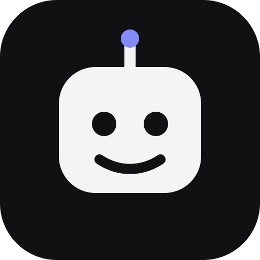

<div align="center">
  

  <h1>Open Bots</h1>

  <p><strong>An open-source runtime for persistent AI agents.</strong></p>
  <p>Run your own team of agents using the models and subscriptions you already use.</p>

  <p>
    
    
    
    
  </p>
</div>

> [!IMPORTANT]
> Open Bots is experimental and under active development. The desktop foundation and local agent persistence work today; autonomous agent execution and real provider adapters are still being built.

## Your agents. Your machine. Your models.

Most agent systems blur the line between the agent and the model behind it. Open Bots treats them as separate parts:

```text
Agent Runtime != Model Provider
```

An agent is a persistent identity with a role, workspace, instructions, permissions, tasks, memory, and runtime state. A provider is simply the interchangeable brain used when the agent needs to reason.

```text
                              ┌─ Codex CLI
Persistent Agent ── Adapter ──┼─ Claude Code
                              ├─ Gemini CLI
                              ├─ Ollama
                              └─ OpenAI-compatible APIs
```

Open Bots is not another LLM, IDE, chat client, or vendor-specific wrapper. It is the operating layer around existing AI tools.

## What Open Bots is designed to do

| Capability             | Intent                                                                                           |
| ---------------------- | ------------------------------------------------------------------------------------------------ |
| Persistent identity    | Agents keep their name, role, instructions, workspace, and state across sessions.                |
| Provider independence  | Change the model provider without replacing the agent or runtime.                                |
| Event-driven execution | Agents sleep while idle and wake for tasks, messages, approvals, schedules, and process results. |
| Agent collaboration    | Agents can exchange structured messages, artifacts, and delegated tasks.                         |
| Safe tool use          | Tools declare permissions and sensitive actions can require human approval.                      |
| Local operation        | Application state, workspaces, and provider credentials stay on the user's machine by default.   |
| Observable work        | Structured events create a readable timeline of agent and tool activity.                         |

## Desktop experience

The application uses a compact, dark interface built for supervising a working group of agents rather than chatting with a single assistant.

```text
┌──────────────────┬──────────────────────────────────────────────────────┐
│  Open Bots       │  Agents                              + New Agent     │
│                  │                                                      │
│  ● Agents        │  ┌────────────────────────────────────────────────┐  │
│    Tasks         │  │ ◉  Atlas       Backend Engineer        Working │  │
│    Activity      │  │    Mock Provider · Implement inventory API     │  │
│    Approvals     │  ├────────────────────────────────────────────────┤  │
│    Settings      │  │ ◉  Nova        Frontend Engineer        Waiting│  │
│                  │  │    Mock Provider · Waiting for API contract    │  │
│  ⌘K Commands     │  └────────────────────────────────────────────────┘  │
└──────────────────┴──────────────────────────────────────────────────────┘
```

The current UI includes agent creation and details, tasks, an activity timeline, approvals, provider settings, and a keyboard-accessible command palette.

## Local by default

Open Bots does not require:

- an Open Bots account;
- a cloud backend;
- a remote database;
- mandatory telemetry;
- provider credentials uploaded to an intermediary service.

Application state is stored in a local SQLite database. When real providers are added, the preferred integrations will use official CLIs already installed and authenticated on the machine.

A future optional account may enable sync, backups, web access, teams, or remote workers. Local functionality will remain available without signing in.

## Architecture

```text
┌─────────────────────────────────────────────────────────────┐
│                       Desktop UI                            │
│                 React · TypeScript · Vite                   │
└────────────────────────────┬────────────────────────────────┘
                             │ Tauri commands and events
┌────────────────────────────▼────────────────────────────────┐
│                    Application Services                     │
└────────────────────────────┬────────────────────────────────┘
                             │
┌────────────────────────────▼────────────────────────────────┐
│                       Agent Runtime                          │
│                                                             │
│  Agent Manager · Event Bus · Provider Registry · Tools      │
│  Approvals · Memory · Artifacts · Scheduler · Workspaces    │
└──────────────┬──────────────────────────────┬───────────────┘
               │                              │
┌──────────────▼──────────────┐  ┌────────────▼───────────────┐
│       Domain Model          │  │     Provider Adapters      │
│ Agents · Tasks · Events     │  │ Mock · Codex · Claude · … │
│ Approvals · Artifacts       │  └────────────────────────────┘
└──────────────┬──────────────┘
               │
┌──────────────▼──────────────────────────────────────────────┐
│                      Infrastructure                         │
│       SQLite · Filesystem · Processes · PTY · Git           │
└─────────────────────────────────────────────────────────────┘
```

Key boundaries:

- Domain code has no dependency on Tauri, SQLite, shell commands, or a concrete provider.
- React components do not access the database or operating-system processes directly.
- Tauri handlers remain thin and delegate to application services.
- SQL stays inside repositories and migrations.
- Provider behavior stays inside adapters registered through `ProviderRegistry`.
- Process, Git, PTY, and tool execution remain behind explicit interfaces.

Read the [architecture guide](docs/architecture.md) and [architecture decisions](docs/adr/) for more detail.

## What works today

| Area                                    | Status                           |
| --------------------------------------- | -------------------------------- |
| Tauri 2 desktop shell                   | Functional                       |
| React desktop interface                 | Functional                       |
| Local SQLite initialization             | Functional                       |
| Create and list agents                  | Functional and persisted         |
| Agent validation and status transitions | Functional and tested            |
| Persisted `agent.created` events        | Functional                       |
| Activity timeline from persisted events | Functional; live via event bus   |
| Approval persistence and decisions      | Functional; no agent raises them |
| Per-agent memory notes                  | Sent on a session's first turn   |
| Scheduled routines (interval, daily)    | Triggers recorded; no execution  |
| Desktop notifications                   | Replies, approvals, routines     |
| In-process event bus                    | Functional and tested            |
| Provider registry                       | Functional                       |
| Mock provider                           | Functional; makes no model calls |
| Tasks UI                                | Demonstration data               |
| OpenAI Codex CLI conversations          | Functional; resumes sessions     |
| Workspace writes by agents              | Read-only until permissions UI   |
| Persistent agent loop                   | Not implemented                  |
| Agent collaboration and delegation      | Not implemented                  |
| Background process execution            | Boundary only                    |
| Git, PTY, and artifact storage          | Boundary only                    |

The browser preview deliberately uses labeled demonstration data because SQLite and Tauri commands are available only in the desktop runtime.

## Tech stack

| Layer         | Technology                                  |
| ------------- | ------------------------------------------- |
| Desktop       | Tauri 2                                     |
| Frontend      | React, TypeScript, Vite                     |
| UI            | Tailwind CSS, shadcn/ui conventions, Lucide |
| Backend       | Rust                                        |
| Persistence   | SQLite with `rusqlite`                      |
| Async runtime | Tokio                                       |
| Logging       | `tracing` with structured JSON output       |
| Testing       | Vitest and Rust test harness                |

## Run locally

### Prerequisites

- Node.js 20.19 or newer
- Rust stable
- [Tauri 2 platform prerequisites](https://v2.tauri.app/start/prerequisites/)

### Desktop application

```bash
git clone <your-fork-or-repository-url>
cd open-bots
npm install
npm run tauri dev
```

The local database is created automatically in the operating system's application data directory as `open-bots.sqlite3`.

### Browser UI preview

```bash
npm run dev
```

This mode is useful for interface development. Agent creation is ephemeral and the application displays demonstration data instead of pretending that desktop services are available.

## Project structure

```text
open-bots/
├── src/
│   ├── app/                  # Application shell and navigation
│   ├── components/ui/        # Shared UI primitives
│   ├── features/             # Agent, task, activity, approval, settings UI
│   ├── lib/                  # Desktop API bridge and utilities
│   └── types/                # Frontend contracts
├── src-tauri/
│   └── src/
│       ├── application/      # Use cases and coordination
│       ├── commands/         # Thin Tauri handlers
│       ├── domain/           # Entities and domain rules
│       ├── infrastructure/   # SQLite and OS-facing adapters
│       ├── providers/        # Provider contract and registry
│       ├── runtime/          # Event bus and runtime boundaries
│       └── tools/            # Tool contract and registry
├── docs/
│   ├── adr/                  # Architecture decision records
│   └── architecture.md
└── .github/workflows/        # Continuous integration
```

## Quality gates

Frontend:

```bash
npm run format:check
npm run lint
npm run typecheck
npm test
npm run build
```

Rust:

```bash
cd src-tauri
cargo fmt --check
cargo clippy --all-targets --all-features -- -D warnings
cargo test --all-targets --all-features
cargo check --all-targets --all-features
```

GitHub Actions runs the same checks on pushes and pull requests. Dependency audit results and accepted transitive warnings are recorded in [docs/dependency-audit.md](docs/dependency-audit.md).

## Desktop builds

The `Desktop Builds` GitHub Actions workflow creates installable bundles for:

- Linux x86_64;
- Windows x86_64;
- macOS Apple Silicon;
- macOS Intel.

Run it manually from the Actions tab to download workflow artifacts without creating a release. Pushing a version tag creates or updates a draft GitHub release and attaches the native bundles:

```bash
git tag v0.1.0
git push origin v0.1.0
```

Release versions must remain aligned across `package.json`, `src-tauri/Cargo.toml`, and `src-tauri/tauri.conf.json` before the tag is pushed.

The generated builds are currently unsigned except for ad-hoc macOS signing. Windows may display a SmartScreen warning, and macOS does not receive Apple notarization. Production signing and notarization will be configured only when release credentials are available.

### Automatic updates

Installed builds check for a newer release on launch and from **Settings → Updates**. When one is found, a banner offers to download it, verify its signature, install it, and restart. The check sends a single request to the latest GitHub release's `latest.json`; failures are shown in Settings and never block local use. The launch check can be turned off in Settings, and the browser UI preview does not check for updates.

Update artifacts are signed with a Tauri updater key, separate from OS code signing. The release workflow needs these repository secrets:

- `TAURI_SIGNING_PRIVATE_KEY`: the private key content matching the `pubkey` in `src-tauri/tauri.conf.json`;
- `TAURI_SIGNING_PRIVATE_KEY_PASSWORD`: its password.

Updater artifacts are only produced by the release workflow (`src-tauri/tauri.release.conf.json`), so local `tauri build` runs do not need the key. Clients only see a release after its draft is published, because the endpoint follows GitHub's latest published release.

Supported update targets: Windows (NSIS and MSI, installed passively), macOS (`.app` bundles), and Linux AppImage. `.deb` and `.rpm` installs cannot self-update and must be upgraded through the package manager. End-to-end updates have not been verified yet, including on ad-hoc signed macOS builds.

Losing the private key means existing installations can no longer verify new updates, so keep a backup.

## Roadmap

### Foundation — current

- [x] Tauri desktop shell
- [x] Local SQLite persistence
- [x] Agent identity and creation flow
- [x] Provider abstraction and registry
- [x] Internal event bus
- [x] Approval, tool, process, PTY, Git, scheduler, and artifact boundaries
- [x] Mock provider
- [x] Quality gates and CI

### Runtime — next

- [ ] Persistent agent execution loop
- [x] Real activity timeline backed by persisted events
- [ ] Task creation, assignment, and state transitions
- [x] Provider session lifecycle and resume
- [ ] Background processes and completion events
- [x] Persisted approvals and decisions
- [ ] Tool permissions connected to approval requests
- [ ] Agent-to-agent messages and task delegation
- [ ] Local artifact storage and exchange

### Expansion — later

- [x] OpenAI Codex CLI adapter
- [ ] Claude Code and Gemini CLI adapters
- [x] Scheduled routines and desktop notifications
- [ ] Git worktrees
- [ ] Remote workers and provider plugins
- [ ] Optional cloud sync and accounts
- [ ] Web and mobile control planes
- [ ] Teams and hosted workers

Cloud backends, mandatory login, billing, vector databases, RAG, containers per agent, complex workflow DAGs, browser automation, and mobile applications are intentionally outside the current scope.

## Contributing

Open Bots is early and contributions should stay focused, testable, and honest about incomplete behavior.

- Read [CONTRIBUTING.md](CONTRIBUTING.md) for setup and pull request guidance.
- Coding agents and automated contributors must follow [AGENTS.md](AGENTS.md).
- Provider proposals must use official integration mechanisms and explain capabilities, cancellation, authentication, and credential handling.
- Significant architectural changes should begin with a focused ADR or design discussion.

## License

Open Bots is licensed under the [Apache License 2.0](LICENSE), including an explicit patent grant.

---

<div align="center">
  <strong>Local by default. Bring your own AI.</strong>
</div>
